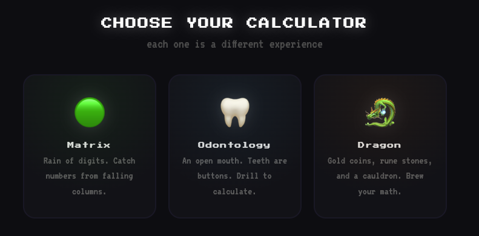
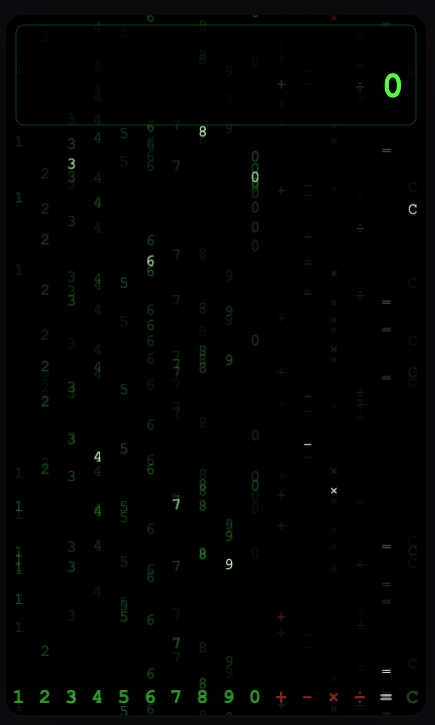
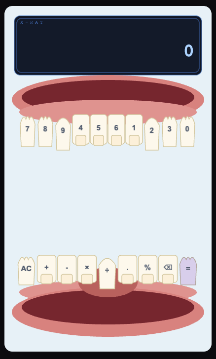
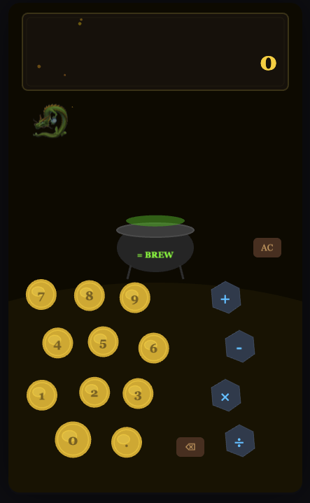

# Fun Calc 🎮

A wildly unconventional calculator where **each theme is a completely different experience** — not a reskin, but a unique visual world rendered on canvas with [PixiJS](https://pixijs.com/). Built with **Rust + Tauri** backend and vanilla JS.

[](LICENSE)
[](https://www.rust-lang.org/)
[](https://tauri.app/)
[](https://pixijs.com/)
[](#testing)
[](#getting-started)

---

## Screenshots

<!-- Add your screenshots here. Drop PNGs into docs/screenshots/ -->
<p align="center">
  
</p>

<details>
<summary><strong>View all themes</strong></summary>

| Theme | Preview |
|---|---|
| Matrix |  |
| Odontology |  |
| Dragon |  |

</details>

---

## Themes

Every theme is a **full PixiJS canvas application** — its own UI, its own interaction model, its own visual language. They share only the math engine.

| Theme | How It Works |
|---|---|
| **Matrix** 🟢 | **No buttons.** 16 columns of falling characters fill the screen — each column rains a single digit (green), operator (red), `=` (white), or `C` (dim). **Click a column** to grab its character — the column freezes, the character flies to the display. Hover a column to highlight it. Press the `=` column and all rain **accelerates wildly**, freezes white, then the answer types out character by character. |
| **Odontology** 🦷 | An **open mouth** with gums, lips, and tongue. Upper teeth are digit buttons (molars, canines, incisors — shaped like real teeth). Lower teeth are operators. Click a tooth and it **vibrates with drill sparks**. Results appear on an **X-ray light panel**. Errors cause **cavities** — teeth darken and crack. AC triggers a polish sweep. |
| **Dragon** 🐉 | A dark cave with a **dragon's treasure hoard**. Gold coins have numbers embossed on them — click one and it **flips** and flies to the display. Operators are **glowing rune stones**. A **cauldron** sits in the center — press it to brew your calculation. Fire **erupts from the cauldron** on equals. Big results trigger a **dragon flyby** across the screen leaving a fire trail. |

---

## Getting Started

### Browser Mode (no Rust needed)

```bash
cd src
python3 -m http.server 1420
# Open http://localhost:1420
```

Requires internet for PixiJS CDN on first load.

### Desktop App (Rust + Tauri)

```bash
# Prerequisites: Rust 1.70+, Node.js
cd src-tauri
cargo tauri dev
```

### Build for Production

```bash
cd src-tauri
cargo tauri build
# Output: src-tauri/target/release/bundle/
```

---

## Architecture

```
src/
  index.html          Menu + canvas container (minimal HTML)
  engine.js           Calculator engine — pure math logic, no DOM (State Machine)
  audio.js            Web Audio API sound effects
  pixi-base.js        PixiTheme base class — shared engine wiring (Strategy)
  theme-matrix.js     Matrix theme — rain, flying digits, cascade
  theme-odonto.js     Odontology theme — mouth, teeth, drill sparks, X-ray
  theme-dragon.js     Dragon theme — coins, runes, cauldron, fire
  app.js              Menu rendering + theme lifecycle (Mediator)
  style.css           Menu styles only (themes render on canvas)

src-tauri/
  src/
    main.rs           Tauri app bootstrap
    engine.rs         Formatting, scientific functions, constants (48 tests)
    parser.rs         Tokenizer + recursive-descent evaluator (26 tests)
    commands.rs       Tauri command handlers (thin wrappers)
  Cargo.toml
  tauri.conf.json

tests/
  engine.test.js      180 unit tests for the JS calculator engine
```

### How Themes Work

Each theme extends `PixiTheme` and implements 5 methods:

| Method | Purpose |
|---|---|
| `_buildScene()` | Creates all PixiJS display objects (the entire UI) |
| `_updateDisplay(expr, display)` | Renders the current expression and result |
| `_onResult(result)` | Animates a successful calculation |
| `_onError(message)` | Animates an error |
| `_onClear()` | Animates a reset |

The base class handles engine integration, audio, and helper animations (`tween`, `flyTo`). Themes handle their own click events and call `this.digit()`, `this.op()`, `this.equals()`, etc.

### Design Patterns

- **State Machine** — Calculator engine alternates between INPUT and RESULT phases
- **Strategy** — Each theme implements the same interface with completely different rendering
- **Mediator** — `app.js` coordinates menu, theme lifecycle, and keyboard events
- **Template Method** — `PixiTheme` defines the skeleton; subclasses fill in the specifics

---

## Testing

### JavaScript (180 tests)

```bash
node tests/engine.test.js
```

Covers: tokenizer, expression evaluator (precedence, parens, unary, edge cases), number formatting, scientific functions, constants, full calculator state machine (chaining, trailing operators, repeated equals, parentheses, sign toggle, decimal input, multi-digit, negative numbers, history cap, error recovery, backspace edge cases).

### Rust (74 tests)

```bash
cd src-tauri
cargo test

# Or run modules standalone (no network needed):
rustc --edition 2021 src/parser.rs --test -o /tmp/parser_test && /tmp/parser_test
rustc --edition 2021 src/engine.rs --test -o /tmp/engine_test && /tmp/engine_test
```

Covers: tokenizer, recursive-descent parser, operator precedence, parentheses, scientific functions, domain errors, number formatting edge cases.

---

## Contributing

See [CONTRIBUTING.md](CONTRIBUTING.md) for guidelines on adding new themes.

## Security

See [SECURITY.md](SECURITY.md) for reporting vulnerabilities.

## Code of Conduct

See [CODE_OF_CONDUCT.md](CODE_OF_CONDUCT.md).

## License

[MIT](LICENSE)
